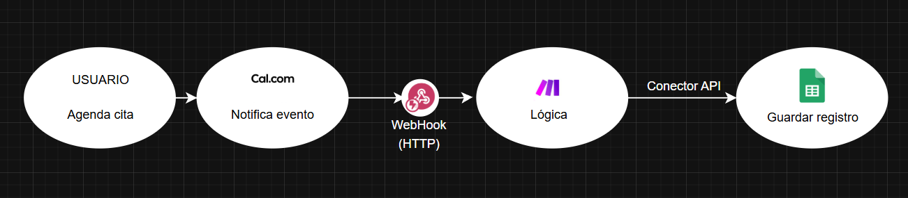
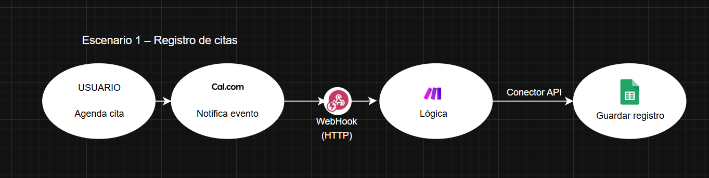
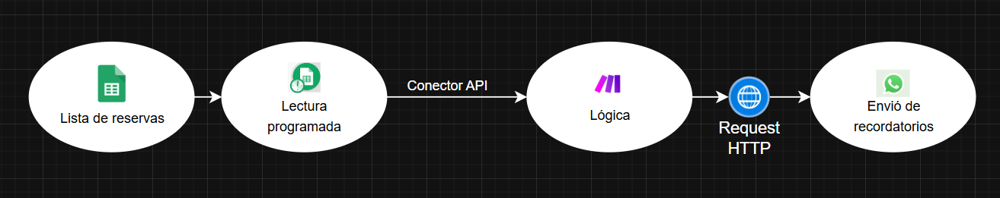
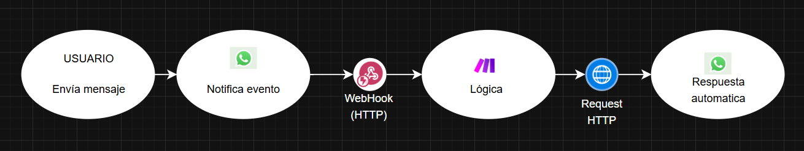

# 📅 Sistema de Automatización de Reservas y Mensajería

## 🚀 Descripción General

Sistema de automatización orientado a la gestión de citas y comunicación con clientes mediante integración de servicios externos.

El flujo está orquestado con Make y conecta:

- 📩 WhatsApp Cloud API  
- 📆 Cal.com  
- 📊 Google Sheets  

El sistema permite responder mensajes, registrar reservas y enviar recordatorios sin intervención manual.

---

## 🎯 Problema

La gestión manual de citas implicaba:

- Envío manual de confirmaciones
- Registro manual de reservas
- Riesgo de errores administrativos
- Pérdida de tiempo en tareas repetitivas

---

## 💡 Solución Implementada

Se diseñaron flujos automatizados basados en eventos que permiten:

- ✔ Responder automáticamente mensajes entrantes
- ✔ Enviar recordatorios programados
- ✔ Registrar reservas en una base estructurada
- ✔ Sincronizar eventos entre plataformas

El sistema funciona bajo una arquitectura orientada a eventos, donde cada servicio genera acciones que activan flujos automáticos.

---

## 🏗 Arquitectura General

- WhatsApp envía eventos cuando se reciben mensajes.
- Cal.com genera eventos cuando se agenda una cita.
- Make procesa los eventos y ejecuta acciones según reglas configuradas.
- Google Sheets almacena y organiza la información.
- Usuario interactua con whatsApp se le envia un mensaje predefinido

---

## 🔄 Flujos Implementados

### 1️⃣ Registro de Reservas

 

- Recepción de evento desde Cal.com.
- Extracción de datos de la cita.
- Registro estructurado en Google Sheets.

### 2️⃣ Recordatorios Automáticos

  

- Lectura programada desde Google Sheets.
- Envío automático de mensajes vía WhatsApp.

### 3️⃣ Respuestas Automáticas

 

- Recepción de eventos entrantes desde WhatsApp.
- Procesamiento del mensaje.
- Envío de respuesta automática.

---

## 📈 Impacto

- 🔹 Reducción significativa de tareas manuales  
- 🔹 Disminución de errores administrativos  
- 🔹 Mejora en tiempos de respuesta  
- 🔹 Arquitectura escalable y adaptable  

---

## 🛠 Tecnologías Utilizadas

- Orquestación: Make  
- Mensajería: WhatsApp Cloud API  
- Agendamiento: Cal.com  
- Almacenamiento: Google Sheets  

---
